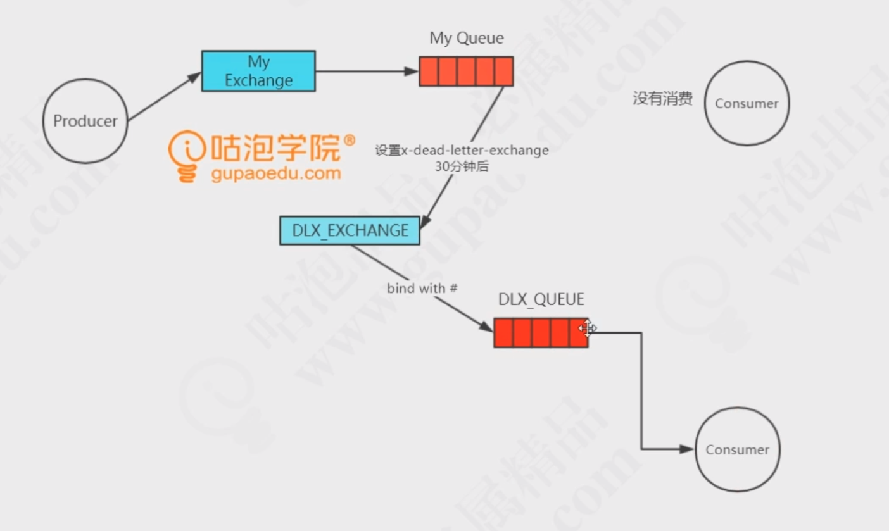

## RabbitMQ

### RabbitMQ中的基本概念

- broker
  - 接受和分发消息的应用，不熟在服务器上的消息系统就是一个broker
- virtual host
  - 把AMQP的基本组件划分到一个虚拟的分组，类似namespace的概念。每个用户在自己的vhost创建exchange、queue，用作不同用户的权限隔离
- connection
  - publisher/consumer和broker之间通过TCP链接，断开连接操作只会发生在client端，broker不会断链接，除非网络故障或者broker服务有问题
- channel
  - 并非每次访问RabbitMQ都要建立connection，channel是在connection内部建立的逻辑连接。AMQP method包含了channel id帮助客户端和message broker识别channel，所以channel之间是完全隔离的。channel作为轻量级的connection较少了操作系统建立tcp connection的开销
- exchange
  - message到达broker的第一站，根据分发规则，匹配查询表中的routing key，分发消息到对应的queue中，常见的类型有direct(point-to-point)/topic(发布-订阅)和fanout(扇出/multicast)
- queue
  - 消息最终被发送到queue中等待consumer取走，一个message可以被拷贝到多个queue中
- binding
  - exchange和queue之间的虚拟连接，binding中可以包含routing key.binding消息被保存到exchange中的查询表中，用于message的分发依据

### exchange的类型

- work消息模型
  - 当消息处理比较耗时，为了使queue中不造成消息的堆积，使用work模型，让多个消费者绑定到这个队列，共同处理消息
  - work包含两种策略
    - 轮询 round-robin
    - fair 需要设置channel.basicQos(int perferchCount)，并且关闭autoAck。参数表示一个消费者同时处理几个消息。这是RabbitMQ会寻找空闲的消费者分发消息
- direct
  - 根据routing key，exchange通过一个routing key与队列绑定
- fanout
  - 没有routing key的概念，只要与交换机绑定的queue都会收到消息
- topic
  - 交换机规则与routing key有关系，通过*,#(*表示过滤一个单词，#表示过滤后面所有单词)来识别routing key 

### 如何避免重复消费和重复投递

生产消息时，MQ内部针对每条生产者发送的消息都生成一个inner-msg-id，当消息投递失败时作为去重的依据，避免重复的消息进入队列

消息消费时，要求消息体中必须有一个bid(业务id,比如订单id/支付id)作为去重依据，避免被重复消费

### RabbitMQ如何保证高可用 

RabbitMQ的三种模式

- 单机模式

- 集群模式

  多台机器启动多个RabbitMQ。但是创建queue时，只会放在一个RabbitMQ实例上，其他实例会同步queue的元数据。当消费时，如果连接上是非主实例，那么这个实例会从queue所在的实例上拉取数据过来

  问题：

  1. 可能在RabbitMQ内部产生大量的数据传输，瓶颈在主实例
  2. 可用性没有保障，如果queue所在的节点宕机，导致queue内数据丢失，无法消费

- 镜像集群

  所谓的高可用模式，创建的queue无论是元数据还是queue消息都会存在于多个实例上，每次写消息到queue时，都会自动把消息同步到多个实例的queue中

  好处：

  - 任何一个机器宕机，不会影响别的机器

  坏处：

  - 性能开销大，消息同步到所有机器，网络带宽压力和消耗很重
  - 没有扩展性，如果某个实例负载很高，加机器也需要同步queue所有数据，没办法扩展

### 如何保证消息的可靠性传输

#### 生产者丢数据

1. 生产者将数据发送到RabbitMQ时，选择使用RabbitMQ的事务功能。发送数据之前开启channel.txSelect，然后发送消息，如果消息没有被RabbitMQ成功接收，那么生产者收到异常，回滚事务，然后重试。缺点是开启事务后吞吐量下降，非常消耗性能
2. 开启confirm，在生产者处设置开启confirm模式，每次写的消息都会分配一个唯一的id，如果写入RabbitMQ，会回传一个ack消息，表示消息成功了；如果mq没有处此消息，会回调一个nack借口，通知消息接受失败，可以重试
3. 事务与confirm的区别：事务是同步，提交事务后会阻塞；confirm是异步的，发送之后就可以处理后续消息，RabbitMQ接受消息后异步回调一个接口通知消息已经收到。

#### RabbitMQ丢失数据

1. RabbitMQ开启持久化：
   1. 创建queue的时候将其设置为可持久化的，这样保证持久化queue元数据
   2. 发送消息的时候将消息的deliveryMode设置为2，将消息持久化
2. 持久化跟生产者的confirm配合，只有消息持久化到磁盘，才返回给生产者ack,这样就保证前两部数据不会丢失

#### 消费者丢失数据

1. 使用RabbitMQ的ack机制，关闭RabbitMQ的自动ack，每次消费者内部处理完后，程序中手动返回ack

### 消息如何路由、分发

生产者->broker ->消费者

- 消息在创建的时候绑定一个routing key
- 交换机和队列通过routing key绑定
- 消息到达交换机后，RabbitMQ将消息routing key与队列的routing key进行匹配，然后进行分发

### 如何设置消息的过期时间

- 通过设置queue属性，使得队列中所有消息都有相同的过期时间
- 对消息本身进行单独的设置，每条消息的TTL都可以不同
- 如果两种策略一起使用，则消息的TTL以两者之间较小的为准
- 消息过期后称为dead letter

### 如何实现延时队列

使用死信交换机

消息投递到一个没有消费者的队列中，为这个队列指定死信队列，当消息到达时间还没有被消费时将会过期，变成dead  letter

队列设置了dead letter exchange，那么死信会被重新发布到死信交换机，通过死信交换机路由到其他队列，实现延时队列

### vshot是什么？有什么作用

虚拟的broker，拥有独立的权限系统，使不同的应用跑在不同的vhost中