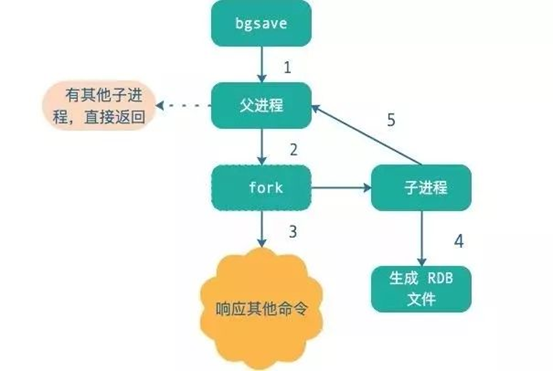

# Redis的高可用

Redis中，实现高可用技术主要包含持久化、复制、哨兵和集群

- 持久化

  最简单的高可用方法，主要作用是数据备份，将数据存储在硬盘，保证数据不会因为进程退出而丢失

- 复制

  复制时高可用Redis的基础，哨兵和集群都是在复制基础上实现高可用的。复制主要实现了数据的多机备份以及对读操作的负载均衡和简单的故障恢复，缺点是恢复无法自动化，写操作无法负载均衡，存储能力受到单机的限制

- 哨兵

  在复制的基础上，哨兵实现了自动化的故障恢复。缺点是写操作无法负载均衡，存储能力受到单机限制

- 集群

  通过集群，Redis解决了写操作无法负载均衡以及存储能力受到单机限制的问题，实现了比较完善的高可用方案

    

## 持久化 

### 持久化方式

- 快照RDB
  - 定期对数据进行备份，将Redis中的数据快照持久化到硬盘中
- 追加文件AOF
  - 执行写命令的时候，将执行的写命令复制到硬盘文件中，后续恢复时重新执行文件中的命令即可

### 快照RDB持久化

- 创建快照方式

  - 客户端通过向Redis服务器发送**BGSAVE**命令来创建

    - 使用BGSAVE时，Redis会调用fork创建一个子进程，然后子进程负责将快照写到硬盘中，父进程继续处理命令请求

    - 使用场景

      - 如果用户使用save配置，例如 `save 60 100`那么从Redis最近一次常见快照之后算起，当60s内有1000次操作的时候，Redis自动触发bgsave命令

      - 当用户使用了多个save设置，则同时生效，只要满足了个save条件，都会触发一次bgsave命令

        ​       

  - 客户端通过向redis发送save命令创建快照

    - 接收到save命令的redis服务器在快照创建完之前将不会响应其他任何请求，阻塞命令请求。save不常用，只有在没有足够内存的时候才会使用
    - 使用场景
      - 当Redis通过shutdown命令接收到关闭服务器的时候，会执行一次save命令，阻塞所有的客户端，不再执行客户端发送的任何命令，并且在执行完save命令之后关闭服务器

- 注意事项

  - Redis占用内存也来越大时，**BGSAVE**在创建子进程时消耗时间也越来越多
  - 使用**save** 命令虽然会一直阻塞Redis，但是不需要创建子进程，所以不会因此造成Redis卡顿，save常见快照速度要比**bgsave**创建快照速度更快

- 特点

  - RDB是一种快照模式，保存的是key-value数据内容，会有多个文件，每个文件代表某一时刻的完整数据快照
  - RDB两种持久化方式，同步save模式和异步bgsave模式，由于save是同步的，可以保证数据一致性，而bgsave不行
  - save可以在客户端显式触发，也可以在shutdown时自动触发；bgsave只能在客户端显式触发，可以通过配置触发，也可以在slave节点触发
  - save命令导致Redis同步阻塞；bgsave是异步的，但是fork时，增加了内存的开销
  - 默认执行shutdown时，如果没有开启AOF，则自动执行save

- 关于优化

  - Redis会压缩RDB文件，使用LZF算法，让最终的RDB文件远小于内存打下，默认开启，消耗CPU

- 缺点

  - 无法秒级持久化
  - 老版本Redis无法兼容新版本的RDB文件

- 优点

  - 文件紧凑，适合备份、全量复制场景。例如每6小时执行一次bgsave，保存到文件系统
  - Redis加载RDB恢复数据远远快于AOF

### AOF持久化配置

AOF持久化会将被执行的写命令追加到AOF文件的末尾

- 打开持久化

  - 通过以下命令打开AOF

    ```bash
    appendonly yes
    ```

  - 通过以下命令配置AOF同步频率

    ```bash
    appendfync everysec/always/no
    ```

  - 频率说明

    - always	
      - 每个Redis写命令都要同步到硬盘，这样会严重降低Redis的写入速度
      - always策略需要对硬盘有大量的写操作，所以Redis处理速度会受到磁盘性能的限制
    - everysec	
      - 每秒执行一次同步，显式的将多个写命令同步到硬盘
      - everysec方式，Redis以每秒一次的频率对AOF文件进行同步。这样既可以兼顾数据安全也可以兼顾写入性能。可以保证即使出现故障，丢失的数据也是在1秒之内产生的数据
    - no	
      - 让操作系统来决定应该何时进行同步系统缓存 
      - Redis不对AOF文件执行任何显式的同步操作，而是由操作系统来决定应该何时对AOF文件进行同步。这个操作不会对Redis性能造成很大的影响，但是当故障出现时可能会丢失一定的数据。另外磁盘写入速度慢，缓冲区被等待写入硬盘的数据填满时，Redis的写入操作将会被阻塞，所以一般不推荐这个选项

- 重写/压缩AOF文件

  - 什么是rewrite：内存大小是一定的，AOF会存放每条写命令到文件，所以会不断膨胀，当达到一定程度就会做rewrite操作，基于当前Redis内的数据来重新构造一个更小的AOF文件，将旧的膨胀的很大的文件删除
  - 用户可以向Redis发送BGREWITEAOF命令，这个命令会通过移除AOF文件中冗余命令来重写AOF，尽量减小AOF文件
  - BGREWRITEAOF的工作原理和BGSAVE类似，Redis创建一个子进程，然后由子进程负责对AOF文件的重写操作

- 触发重写/压缩AOF文件条件设定

  - AOF通过设置auto-aof-rewrite-percentage（当文件体积变大百分之多少）和auto-aof-rewiter-min-size（当AOF文件体积大于多少MB）来自动执行BGREWITERAOF

- AOF特点

  - AOF文件只会有一个，存放的指令日志
  - 默认文件名为appendonly.aof，与RDB文件一起保存在配置中的dir目录下
  - AOF相比较于RDB，每次都会保存写命令，数据实时性更高
  - AOF每次保存的写命令都会放在一个缓冲区，根据不同的策略同步到磁盘

- 重写的流程

  - fork子进程

  - 主进程会写2个缓冲区，一个是原有的AOF缓存区，另一个是专门为子进程准备的AOF重写缓冲区

  - 子进程会从当前Redis中读数据转成键值对命令（如图中第4步），写完后通知主进程

  - 主进程将AOF重写缓冲区的数据写到新的AOF文件中

  - 将新的AOF替换老文件

    ​       

### 验证快照文件和AOF文件

- Redis提供两种命令行程序
  - redis-check-aof
  - redis-check-dump
  - 系统发生故障需要恢复，检查AOF文件的状态，并对有需要的情况对文件进行修复，如果用户在运行redis-check-aof命令的时候，指定了--fix参数，那么程序将对AOF进行修复：
    - 扫描给定的AOF文件，寻找不正确或者不完整的命令，程序删除出错的命令及之后的所有命令

### 持久化恢复

- AOF和RDB文件都可以用于服务器重启时的数据恢复
- 先加载AOF，因为AOF中的数据更加完整，当没有AOF时再加载RDB。当AOF或RDB存在错误，则加载失败

​       

## 主从架构

### 概述

主从复制，将一台Redis的数据复制到其他Redis服务器。前者称为主节点（master）后者称为从节点（slave），数据的复制是单向的，只能由主节点到从节点

主从复制的作用

- 数据冗余

  主从复制实现数据的热备份，持久化之外的数据冗余方式

- 故障恢复

  当主节点出现问题，可以由从节点提供服务，实现故障恢复，也是服务的冗余

- 负载均衡，

  主从复制的基础上，配合读写分离，主节点提供写，从节点提供读，分担服务器压力，提高并发量

- 高可用的基石

  主从复制是哨兵和集群能够实施的基础

### 主从复制

#### 连接阶段

- 保存主节点信息
  - 从节点保存master host和master port两个字段
  - slaveof是异步命令，此命令收到返回的ok，实际的复制操作就开始了
- 建立socket连接
  - 从节点为该连接建立一个专门处理复制工作的文件事件处理器，负责后续的复制，比如接收RDB文件接收命令传播等
  - 主节点接收到从节点的socket连接后，为该socket创建相应的客户端状态，将从节点当成连接到主节点的一个客户端
- 发送ping检查socket是否可用以及主节点是否能够处理请求
- 身份验证
  - 如果从节点设置了master auth，从节点需要向主节点进行身份验证
- 发送从节点端口信息
  - 主节点保存在对应客户端的slave_listening_port字段
  - 此端口信息除了在主节点中执行info replication时显示外没有其他作用

#### 数据同步阶段

- 从节点向主节点发送psync命令，开始同步
- 根据主从节点状态的不同，分为全量复制和部分复制
- 在数据同步之前，从节点是主节点的客户端；到了数据同步阶段，主从节点互为客户端，原因：同步节点主节点需要主动向从节点发送请求，如推送缓存区中的写命令，来完成复制

#### 命令传播

- 数据同步结束之后开始命令传播
- 主节点将自己执行的写命令发送给从节点，从节点接受命令并执行，从而保证从节点数据保持一致
- 除了发送命令，还要维持心跳:ping和replconf ack

### 全量复制和增量复制

全量复制用于初次复制或其他无法进行部分复制的情况，将主节点中所有数据都发送给从节点，非常重量级

增量复制用于网络中断等异常情况后的复制，只将中断期间主节点执行的写命令方法发送给从节点，比全量更高效，如果网络中断时间过长，导致主节点没有完整保存中断期间执行的写命令，则无法进行部分复制，仍然为全量复制

#### 全量复制

- 主节点收到全量复制的命令，执行bgsave，在后台生成RDB文件，使用缓冲区记录从执行bgsave到结束时的所有写命令
- 主节点bgsave完成后，将RDB文件发送给主节点；从节点先清除本身旧数据，然后加载RDB文件，将数据库状态更新为bgsave执行时的状态
- 主节点将缓冲区的命令给从节点，从节点执行将数据库状态更新
- 如果从节点开启了AOF，会触发bgrewriteaof，更新aof文件

### 无磁盘化复制

master在内存中直接创建RDB，发送给slave，不会在本地落盘，类似零拷贝的概念

### 过期key处理

slave不会过期key，只会等待master过期key，然后模拟一个del命令发送给slave

## Redis集群  

为了保证高可用和读写能力，前面说了maste-slave结构

当数据量非常大时，可以使用类似分库分表的处理方式，即集群

### 资源定位

当有多个设备，数据分散在不同设备上，需要知道具体数据是存储在哪台设备上

- Hash

  - 根据key的hash对设备数量进行取模
  - 问题：当服务器数量发生变动，所有缓存的位置都需要发生改变，类似hashmap中rehash

- 一致性hash算法

  - 一致性hash算法是对2^32取模，将整个hash值空间组织成一个虚拟的圆环，圆环正上方代表0，顺时针依次增加，直到2^32-1

    ​       

  - 问题：发生数据倾斜，服务节点很少时，容易发生分布不均匀

- Redis cluster的hash slot

  - hash slot有固定的16384个，对每个key计算CRC16然后对16384取模，获取key对应的hash slot
  - key与hash slot进行绑定，如果某台机器宕机，该机器上的hash slot平分到其他服务器，key随hash slot一起迁移
  - hash slot node的增加和移除很简单，增加一个master，就将其他master的hash slot移动部分过去，减少master，就将其hash slot移动到其他master上，移动hash  slot的成本很低
  - 客户端可以通过hash tag实现指定数据走同一个hash slot

### 节点间通信

- Redis cluster节点元数据维护
  - 集中式
    - 好处：元数据的更新和读取时效性很好，一旦出现数据变更，立即更新集中存储，其他节点就能感知到
    - 缺点：集中式存储服务的压力很大
  - Gossip
    - 好处：元数据的更新比较分散，更新请求会陆续分发到所有节点上去，降低了压力
    - 元数据更新有延迟，导致集群的一些操作滞后
- 端口信息
  - 节点通信端口是自己提供服务的端口号+10000
  - 节点间通信每隔一段时间就会向其他节点发送ping消息
- 交换信息
  - 故障信息、节点的增加和移除、hash slot等

### 高可用性与主备切换原理  

- 判断节点宕机
  - 如果一个节点认为另一个节点宕机，那么就是pfail，主观宕机
  - 在cluster-node-timeout内，某个节点一直没有返回pong，那么就被认为是pfail
  - 如果一个节点被认为是pfail，将会被在gossip的ping消息中发送给其他节点
  - 如果超过半数的节点都认为一个节点pfail，那么就会变成fail，客观宕机
- 从节点过滤
  - 需要从slave node中选一个切换成master node，检查slave node与master断开连接的时间，如果超过了cluster-node-timeout * 就没有资格切换、
- 从节点选举
  - 每个从节点，都根据自己对master复制数据的offset来设置一个时间，offset越大的从节点选举时间越靠前
  - 所有的master node开始slave选举投票，给要进行选举的slave进行投票，如果大部分master (N/2+1)都投票给某个从节点，那么选举通过，那个节点就可以切换成master

## Redis哨兵

### 什么是哨兵 

Redis sentinel是一个管控多个Redis实例的工具，他可以实现对Redis的监控、通知、自动故障转移等

​       

- 监控
  - 哨兵不短检查主服务器和从服务器是否正常运行
- 通知
  - 当被监控的某个Redis服务器出现问题，sentinel通过API脚本向管理员或其他程序发送通知
- 自动故障转移
  - 当主节点不能正常工作时，sentinel会开始一次自动的故障转移操作，会将失效主节点的主从关系找其中一个从节点升级为新的主节点

### 工作原理

- Redis sentinel有三个定时任务，判断节点不可达主要是通过定时任务来完整
  - 每个10s每个哨兵会向主节点和从节点发送 `info replication`命令来获取最新的拓扑结构
  - 每隔2s每个哨兵会向Redis节点的__sentinel:hello__频道发送自己对主节点故障的判断
  - 每隔1s哨兵会向主节点、从节点、其他哨兵节点发送一个"ping"命令来做心跳检测

### 主观下线

1. 哨兵每1s向主从节点、其他哨兵做ping心跳检测，如果在down-after-millisecondes时间内没有回复pong，则主观认为该节点不可达，即sdown

     

2. 一个主服务器被标记主观下线，并且达到指定数量的哨兵都在一2时间内判断该节点不可达，则主服务器被标记客观下线odown

     

### 故障转移哨兵leader选举

### 故障转移

故障转移也就是从节点中选出一个节点来当新的主节点

1. 过滤掉主观下线的节点
2. 选择slave-priority最高的节点，如果有则返回，如果没有就继续
3. 选择出复制偏移量最大的从节点，这样复制的数据尽量完整，如果没符合条件的就继续
4. 选择run_id最小的 节点