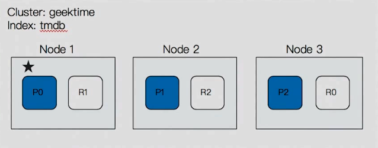

# ElasticSearch

### 为什么使用ElasticSearch

ElasticSearch是一个**实时**的**分布式存储**、**搜索**、**分析**引擎。

相比较MySQL，在模糊查询方面，尤其是前置模糊查询，MySQL会放弃使用索引，全表扫描；ElasticSearch可以根据全文索引，提高查询效率。

### elasticSearch数据结构

- index：相当于MySQL中的的table，是es存储的基本单位
  - index体现了逻辑空间的概念，每个索引都有自己的mapping
- type：已废除（旧版中一个index有多个type）
- mapping：相当于MySQL中schema，字段名和字段类型等信息
- setting：定义不同的数据分布，用到多少分片等信息
- document：相当于MySQL中一行数据
- field：相当于MySQL中column的概念

### 分布式结构中的概念

#### master eligible nodes

- 每个节点启动后，默认就是一个master eligible节点
  - 可以设置node.master:false 关闭
- master-eligible节点可以在必要时参加选主流程，称为master节点

#### master node

- 第一个节点启动时就会将自己选举称为master节点
- 职责
  - 维护更新cluster state，包含集群中必要的信息
    - 所有节点信息
    - 所有的索引元数据，mapping与setting等
    - 分片的路由信息
  - 处理创建、删除索引等请求，决定分片被分配到哪个节点

#### cluster state

- 集群状态信息，包含了
  - 所有节点信息
  - 所有的索引元数据
  - 分片的路由信息
- 在每个节点都保存了集群的状态信息
- 只有master节点才能修改集群的状态信息，并负责给其他节点同步
  - 如果节点都可以主动修改的话会导致cluster state信息不一致

#### data node

- 可以保存数据的节点
- 节点启动默认就是数据节点
- data  node职责：保存分片数据，在数据扩展上起到了至关重要的作用

#### coordinating node

- 负责接受client的请求，将请求分发到合适的节点，最终把结果汇总到一起
- 每个节点都默认起到了coordinating node的职责

#### 选主过程

- 只有候选节点才会被选举
- 投票数必须超过一般，目的是防止脑裂

1. 确认选举节点数是否达标，根据discovery.zen.minimu,,_master_nodes
2. 比较，判断是否是候选节点，如果都具有资格，则node id小的节点会被选举成master

- 节点间互相ping对方，Node id低的会称为被选举的节点

#### 分片

- `主分片(Primary Shard)`用以解决数据水平扩展问题，通过主分片将数据分布到集群内的所有节点上

  - 一个分片是一个运行的Lucene实例
  - 主分片数在索引创建时指定，后续不允许修改，除非reindex
    - 原因：查询时根据shard=hash(documentId)%num_of_primary_shards得出文档位于哪个分片，如果修改了主分片数，那么存入时的分片与查询的分片得出结果就不同了。

- `副本分片(Replica Shard)`用以解决数据高可用问题，是主分片的拷贝

  - 副本分片数，可以动态调整
  - 一旦主分片丢失，副本就可以成为主分片
  - 增加副本数，可以一定程度提高服务的可用性（读取的吞吐）

- 下图片表示主分片有三个，每个主分片有一个副本

  

#### 主分片的数量

- 主分片设置过小
  - 后续无法通过添加节点实现水平扩展
  - 单个节点分配的document数量过大，数据reindex耗时
- 主分片设置过大
  - 影响搜索结果的相关性打分，影响相应结果的准确性
  - 单个节点过多的分片，会导致资源浪费，同时也影响性能

#### 集群的健康情况

- 管理控制台可以通过颜色分辨
  - Green - 主副分片均正常
  - Yellow - 主分片正常，副本分配有问题
  - Red - 有主分片未正常分配

#### Lucene index 

- 在Lucene中，单个倒排索引文件被称为segment。segment是不可变更的。多个segment汇总到一起，称为Lucene的index，对应es中的shard
- 当有新文档写入时，会生成新的segment，查询时会查询所有的segment，并对结果汇总
- Lucene中有一个文件，用来记录所有segment信息，叫做commit point
- 删除的文档信息，保存在.del文件中

### 分布式基本结构

索引可以拆分为多个shard，每个shard都存储部分数据。shard数据有多个副本备份，当主分片写入数据后，将会同步到所有副本分片。主分片负责读写数据，副本分片只能读。类似kafka的结构，每个shard都有多个备份分布在不同的机器上。

es集群有多个节点，会自动选举一个节点为master，负责管理类的工作，比如维护索引元数据、负责切换primary  shard和replica shard身份等。

如果master宕机，则重新选举一个节点称为master节点；如果非master节点宕机，由master将宕机节点上的primary shard身份转移到其他node上的replica shard，接着修复好宕机机器重启后，master节点会控制将缺失的replica shard分配过去，同步后续修改的数据，让集群恢复正常。

### 写入数据过程

#### 写入数据流程

1. 客户端选择一个node发送请求，这个node就是coordinating node，协调节点
2. coordinating node对document进行hash后，路由转发到对应的primary shard所在node
3. 对应的node上primary shard进行处理后，同步到replica node
4. coordinating node确认所有主备shard都写入结束之后，返回相应给客户端

#### shard写入过程

- refresh
  1. primary shard将索引信息先写入index buffer，此时buffer数据搜不到
  2. buffer达到阈值(jvm 10%)或者间隔1s，将buffer数据写到segment file，在文件系统缓存中开放查询，这个过程叫做refresh
  3. segment file会生成很多个
  4. refresh时间配置 index.refresh_interval。经过refresh生成segment后，数据就可以被搜索到，这也是被叫做近实时搜索的原因
- trans log
  - refresh过程所有文件都是在内存或缓存中，为了保证数据不丢失，所以在写入buffer同时写入trans log
  - 高版本是直接落盘，低版本每5s trans log从缓存中刷新到磁盘
- flush
  - 当trans log超过512MB或者每30min调用一次commit操作，或者手动执行flush
    1. 将index buffer数据refresh到segment file中，清空buffer
    2. 调用fsync，将缓存中的segment files写入磁盘，并写commit point文件
    3. 清空trans log
- trans log为什么存在
  - 在commit之前，所有的信息都停留在内存或者缓存中，一旦机器死了，数据就丢失；当重启时，es首先读取trans log日志文件中的数据，恢复到缓存中，下次commit时再写入磁盘segment file
- 删除操作
  - commit时生成一个.del文件，里面将某个documentId标识为delete状态，在搜索时根据.del文件就知道这个doc被删除了
- segment file默认1s就会有1个，因此会定期merge，同是将标注deleted的document物理删除，然后将新的segment file写入磁盘，生成新的commit point

### 读取数据过程

- 通过doc ID搜索
  - 客户端发送请求给任意一个node，称为协调节点coordinating node
  - 协调节点通过对documentId进行路由，将请求转发到对应的node，此时使用round-robin随机轮询算法，在主副本之间随机选一个进行负载均衡
  - 接收到请求的node返回document给coordinating node
  - coordinating node返回document给客户端
- 通过关键字查询
  - 客户端发送请求到一个coordinating node
  - 协调节点将搜索请求转发到所有的shard
  - **query phase** 每个shard将自己的搜索结果(docID)返回给协调节点，由协调节点进行数据的合并、排序、分页等操作，产生最后结果
  - **fetch phase** 由协调节点根据docID去各个节点拉取document数据，最终返回给客户端

### 故障转移

- 集群master node宕机
  - node 1是master节点，包含一个primary shard一个replica shard
  - 集群重新选举一个master节点为node2
  - node 3上的R0提升为P0,集群变黄
  - R0和R1重新分配，集群变绿
- 某个分片不可用
  - 如果primary shard不可用，且该shard有副本，则master将副本分片提升为主分片，同时将自己复制出来一个新的副本，同步数据。