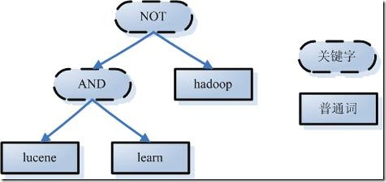

## Lucene

### 什么是lucene

lucene是一个高效的，基于Java的**全文索引库**。

- 数据分为两部分
  - 结构化数据
    - 具有一定格式或有限长度的数据，比如数据库
  - 非结构化数据
    - 不定长或无固定结构的数据，比如文档
- 全文索引就是将非结构化数据中的一部分抽取出来，重新组织，使其变得有一定结构，然后对有了一定结构的数据进行搜索，从而达到搜索相对较快的目的
- 从非结构化数据提取出来重新组织的信息叫做索引
- 全文索引(Full-text Search)的两个过程：创建索引(Indexing)和搜索索引(Searching)

### 索引内的结构

已知文件，求文件内的字符串相对容易，即文件到字符串的映射

已知字符串，求哪些文件中包含这些字符串，即字符串到文件的映射，保存这种信息的索引叫做**反向索引** 

假如文档集合中有100个文档，编号1-100，有下表

****

左边保存一系列字符串，称为词典。每个字符串都指向包含此字符串的文档链表，此文档称为倒排索引链表（posting list）

### 如何创建索引

1. 需要索引的文档（document）

2. 将文档传给分词器（tokenizer）

   1. 讲文档分为独立的单词
   2. 去掉标点符号
   3. 根据语言的停词集合，去掉停词
   4. 形成词元（term）

3. 将词元传给语言处理组件（languistic Processor）

   1. 语言处理组件对词元做一些与语言相关的处理
   2. 对英语来说
      1. 变成小写
      2. 单词缩减变成词根，cars->car，称为 stemming
      3. 单词转变为词根，drove->drive，称为lemmatization
   3. 语言处理组件结束后形成词（term）

4. 将得到的词传给索引组件

   1. 利用得到的词创建一个词典，将词与所在的文档做映射

      | Term    | Document Id |
      | ------- | ----------- |
      | student | 1           |
      | allow   | 1           |

   2. 对字段按顺序排序

   3. 将相同的词合并，形成文档倒排链表

      1. 文档倒排链表是词和文档频次的映射，文档频次有多少，链接的链表就有多少个节点，每个节点是文档ID和文档内频率的映射

### 如何对索引进行搜索

1. 用户输入查询语句

   - 查询语句有固定的语法，根据全文索引系统的实现而不同，比如lucene AND learned NOT hadoop表示想查找包含Lucene和learned但是不包含Hadoop的文档

2. 对语句进行语法分析，词法分析及语言处理

   1. 词法分析找到关键字

   2. 语法分析是根据查询语句的语法规则和关键字生成语法树

   3. 语言处理过程与索引过程类似，去除大小写、缩减、转换词根

      

3. 搜索索引，得到符合语法树的文档

   1. 首先那反向索引表中分别找到lucene、learn、Hadoop的文档链表
   2. 其次对包含Lucene、learn的文档链表合并，得到既包含Lucene又包含learn的文档链表
   3. 然后将此链表与Hadoop的文档链表做差操作，得到包含Lucene和learn而不包含Hadoop的文档链表

4. 根据得到的文档和查询语句的相关性，对结果进行排序

### 总结

### 索引过程

1. 被索引文件经过分词器(tokenizer)形成词元(token)
2. 词元经过语言处理组件(linguistic processor)后形成一系列的词(tern)
3. 经过索引组件(indexer)生成词典和反向索引表
4. 经过索引存储将索引写入磁盘

### 搜索过程

1. 用户输入查询语句
2. 对语句经过语法、词法和语言处理分析得到一系列的词组成的语法树
3. 通过索引存储将索引读入内存
4. 利用查询树搜索索引，得到每个词的文档链表，根据关键字对文档链表进行交、差处理，得到结果文档
5. 对搜索查询得到的结果文档对查询相关性进行排序
6. 将查询结果返回给用户